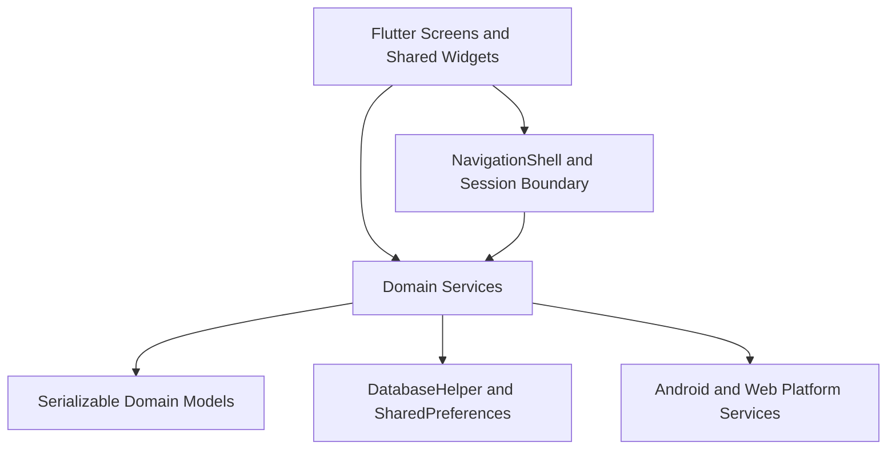
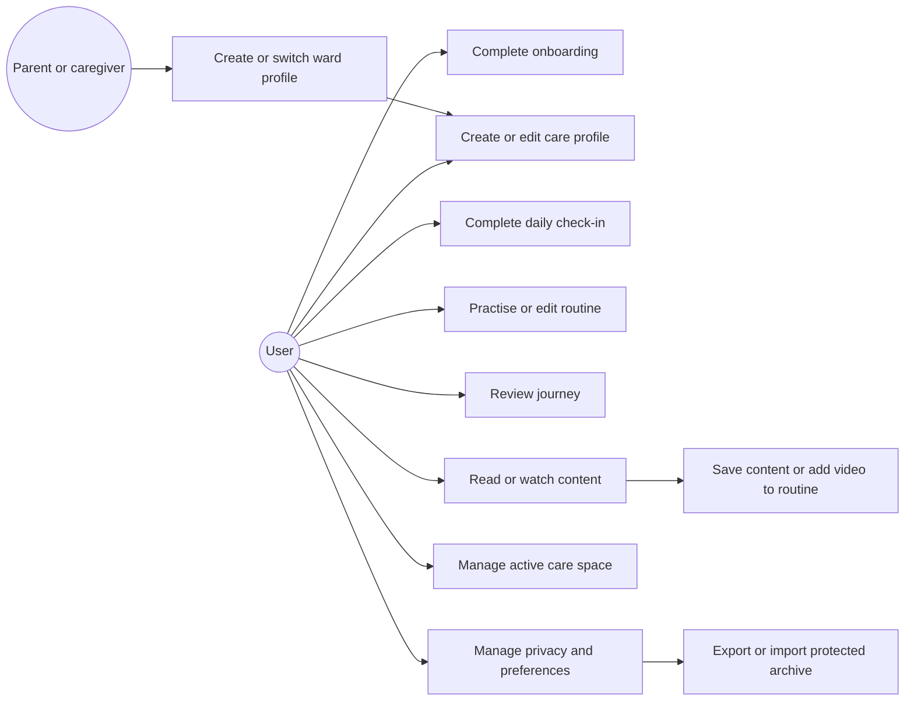
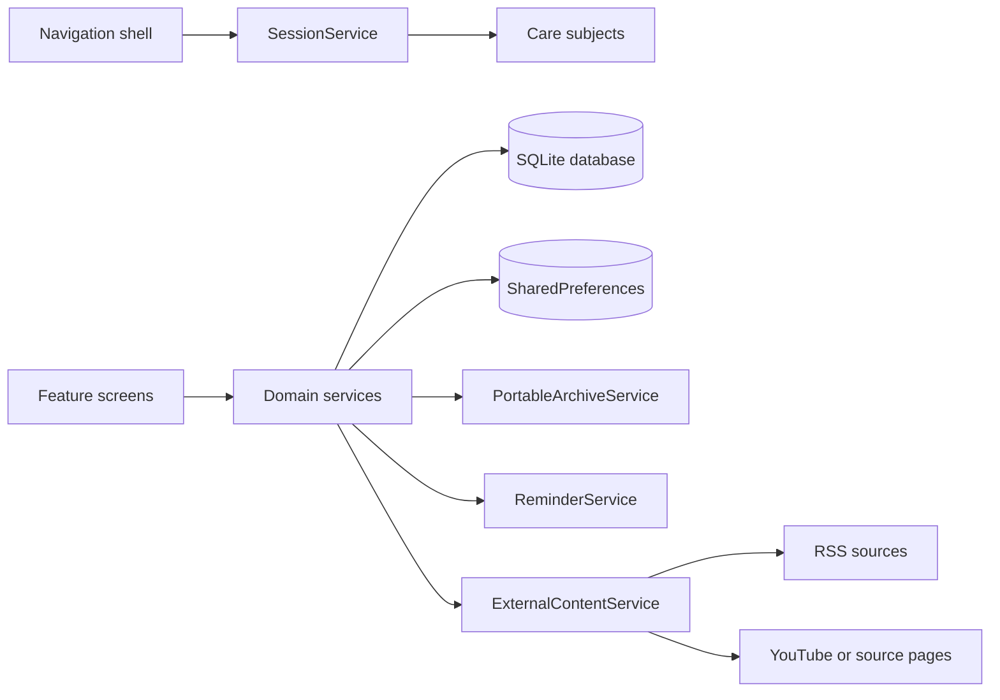
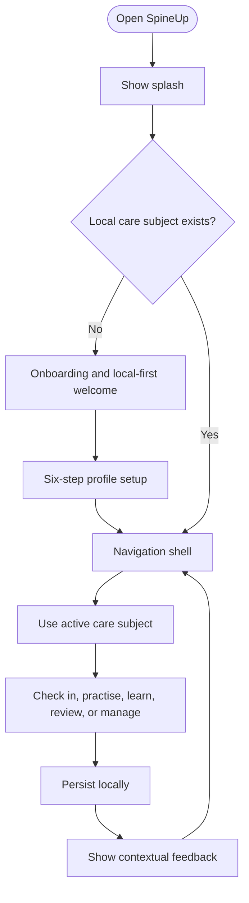
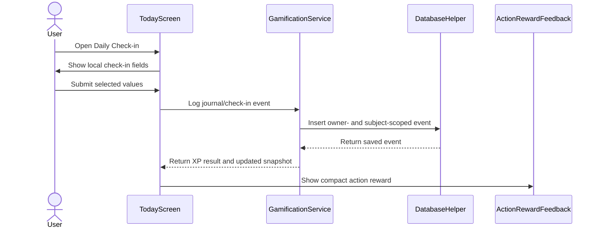
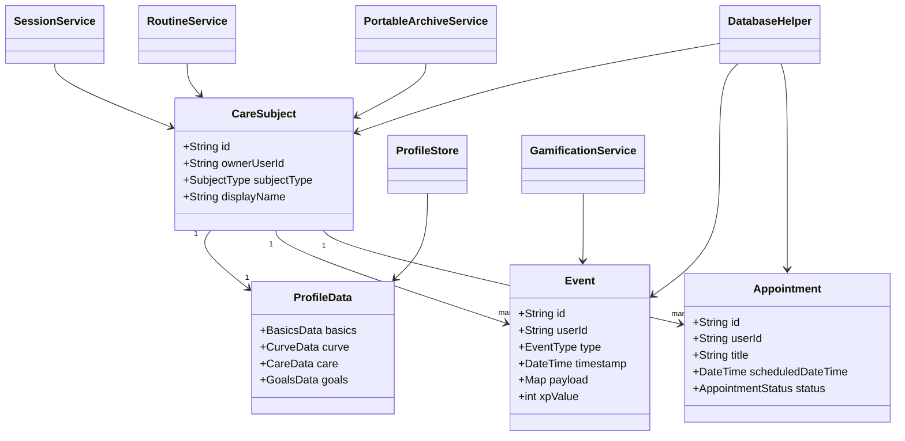

# SPINEUP
## Computer Science Project Documentation
### 2025 / 2026

**Project title:** SpineUp: A Local-First Scoliosis Self-Management Companion

**Platform:** Flutter for Android and Web

**Document revision:** 2.0

**Prepared by:** Manus AI

---

## Declaration

I declare that this project documentation describes the design and implementation of SpineUp, an open-source Flutter application developed as a school Computer Science project. The document is based on the current source repository, its automated tests, its build configuration, and the project decisions recorded during development. External material used to explain related systems, technical standards, or medical context is identified in the References section.

SpineUp is an educational software project and not a clinical research instrument. Its records, educational summaries, exercise descriptions, and charts must not be interpreted as professional diagnosis or treatment advice.

## Dedication

This project is dedicated to people living with scoliosis and to the families, caregivers, teachers, and healthcare professionals who support them. It is also dedicated to students who use software design to make difficult everyday experiences easier to understand and manage.

## Acknowledgement

The project acknowledges the Flutter and Dart communities, the open-source package authors whose libraries support local storage, notifications, media playback, avatars, and cryptographic archives, and the medical and educational sources that informed the application’s safety boundaries. The project also acknowledges the iterative review process through which the navigation, onboarding, charts, routines, profile spaces, content library, and dark-mode behavior were refined.

## Abstract

SpineUp is an open-source, local-first Flutter application for scoliosis self-management and care conversations. It is designed for a person using the app for themselves or for a parent or caregiver managing one or more ward profiles. The application does not require an account, cloud synchronization, advertising, analytics, or a hosted backend for its core experience. Instead, it stores records on the device and gives the user an encrypted export and import path for deliberate portability.

The application combines daily check-ins, local event history, Cobb-angle recording, contextual pain and activity notes, appointment management, guided routines, educational topics, source-linked articles, optional YouTube playback, editable exercise routines, reminders, avatars, XP, streaks, and milestones. The design deliberately separates motivation from clinical interpretation. XP rewards actions such as recording a check-in or completing a stretch; it does not reward a symptom result or claim that a curve has improved.

The project follows a small Flutter architecture in which screens compose the interface, services contain domain rules and persistence operations, models represent serializable data, and a database helper manages SQLite. A structured profile model separates ownership, care information, goals, and optional records from decorative runtime profile information such as avatar settings. Care-subject isolation ensures that a caregiver’s records, routines, saved content, and progress are not shown inside a ward’s care space.

The project’s principal contribution is not a diagnostic algorithm. It is a cohesive, private, understandable, and portable self-management experience that combines record keeping, general education, gentle routines, and preparation for conversations with qualified professionals. Current limitations include placeholder Android application identity, debug signing for the current release build, incomplete F-Droid packaging, and the need for additional real-device testing.

## Table of Contents

1. [Chapter 1: Introduction](#chapter-1-introduction)
2. [Chapter 2: Review of Related Systems](#chapter-2-review-of-related-systems)
3. [Chapter 3: Methodology](#chapter-3-methodology)
4. [Chapter 4: Implementation, Testing, and Results](#chapter-4-implementation-testing-and-results)
5. [Chapter 5: Findings, Conclusions and Recommendations](#chapter-5-findings-conclusions-and-recommendations)
6. [References](#references)

# Chapter 1: Introduction

## 1.1 Background of the Project

Scoliosis is a condition involving three-dimensional changes in the alignment of the spine and trunk. The Cobb angle is commonly used by clinicians to quantify spinal curvature from radiographs, while other observations such as symptoms, brace use, activity, and appointments help describe a person’s wider care experience [1]. People and caregivers may need to remember daily experiences, prepare questions for appointments, follow a clinician-provided routine, and make sense of general educational information without turning a personal record into a self-diagnosis.

Many existing digital tools focus on one narrow function. Some emphasize screening or measurement, some provide prescribed or curve-specific exercise programmes, and some offer broad symptom tracking. SpineUp was conceived as a school project that brings the useful, non-diagnostic parts of these experiences together while placing privacy, ownership, portability, and clear safety language at the centre.

The initial design context is Ghana and West Africa, although the application is not limited to one country. The project therefore avoids requiring a reliable cloud connection for its primary record experience. Optional network features are limited to source-linked educational content, thumbnails, external pages, and YouTube playback.

## 1.2 Problem Statement

A person living with scoliosis or a caregiver supporting them may have information spread across notebooks, messages, appointment papers, video links, and memory. Generic health trackers may be too broad, specialist tools may focus on clinical measurement, and exercise resources may not provide a simple way to connect a video or movement with a personal routine. These gaps can make everyday self-management feel fragmented and can make it difficult to prepare a clear account for a healthcare appointment.

A further problem is trust. Health-related records are sensitive, yet many modern applications are designed around accounts, cloud services, analytics, or commercial identity providers. Users who want a simple private record may not want to create an online account or upload their information. SpineUp addresses this problem by making local storage the default and deliberate export the user’s choice.

## 1.3 Aim of the Project

The aim of SpineUp is to design and implement a warm, accessible, local-first scoliosis self-management application that helps users record everyday care information, follow a gentle personal routine, find general source-linked education, and prepare for conversations with qualified healthcare professionals without presenting itself as a medical authority.

## 1.4 Novelty of the Project

The project’s novelty lies in the combination of several modest but important design decisions. First, a single local owner can manage separate self and ward care spaces without requiring an online identity. Secondly, the application combines structured care records with a non-clinical daily experience rather than treating the user only as a measurement. Thirdly, exercise videos can be saved and included in a personal routine while original sources remain visible. Fourthly, the application provides a protected, owner-scoped portability path without making cloud sync mandatory. Finally, its warm hand-drawn visual language, page-aware tutorials, restrained XP feedback, and adaptive dark-mode surfaces are designed to make repetitive self-management inviting without becoming childish or competitive.

## 1.5 Specific Project Objectives

The project objectives are to:

1. provide a four-area main navigation experience for Today, My Journey, Learn, and Me;
2. provide a six-step profile setup flow that supports self and caregiver-owned ward profiles;
3. store care subjects, events, appointments, profiles, routines, and saved content locally;
4. keep records isolated by local owner and active care subject;
5. support daily check-ins, Cobb-angle logging, appointment records, activity history, and contextual notes;
6. provide editable routines, guided movement steps, timers, and optional video references;
7. provide source-transparent educational content from local briefs, RSS summaries, and optional YouTube playback;
8. provide encrypted export and import for deliberate device changes or backups;
9. provide Android-only local reminders without transmitting health information;
10. use XP, levels, streaks, and milestones as gentle return-use motivation rather than clinical scoring;
11. maintain a cohesive Android/Web visual identity, including the splash-derived launcher icon and bundled typography; and
12. validate the implementation through automated formatting, analysis, tests, and Android builds.

## 1.6 Scope of the Project

The current scope includes Flutter Android and Web builds. Android is the primary mobile target. The app supports first-run onboarding, local profile setup, care-subject switching, daily records, routines, appointments, educational content, avatars, reminders, protected archives, light and dark themes, and local progress feedback.

The scope excludes diagnosis, automatic Cobb-angle measurement from camera images, curve-progression prediction, treatment prescription, emergency triage, mandatory online accounts, cloud synchronization, analytics, advertising, iOS delivery, and an active Community feature. Community remains hidden from the active navigation and is deferred for a future decision.

## 1.7 Project Limitations

The application is not a substitute for professional assessment. Its Cobb-angle screen records values supplied by the user; it does not verify how a value was measured. Its exercise catalogue and source-linked material are general educational resources and do not replace an individualized clinical plan. RSS content depends on external sources and may be unavailable, malformed, or changed. Curated briefs remain available when feeds fail, but a release build must have the correct Android network permission for network-backed content to work.

The current Android application ID is still `com.example.spineup`, and the current Gradle release configuration uses debug signing for local release-mode testing. A recognized open-source `LICENSE`, F-Droid metadata, permanent release signing, production package identity, isolated F-Droid build, and further device QA remain future packaging work.

## 1.8 Academic and Practical Relevance of the Project

Academically, SpineUp demonstrates requirements analysis, human-centred interface design, local database design, data ownership boundaries, encryption, cross-platform development, testing, and software documentation. It also demonstrates how a project can place safety and privacy boundaries around a health-related theme without claiming to deliver a clinical system.

Practically, the application provides one place for a user or caregiver to maintain a small record of daily experiences, appointments, routines, and questions. Its local-first operation can be useful in contexts where connectivity, data costs, or trust in cloud services are important considerations. Its portability feature addresses the practical risk of losing local records when changing devices, provided that the user safely retains the archive passphrase and export file.

## 1.9 Beneficiaries of the Project

The direct beneficiaries are people living with scoliosis, parents, caregivers, and other supporters who want a simple local record and routine companion. Secondary beneficiaries include students and educators studying mobile application design, healthcare professionals who may receive a clearer user-prepared conversation record, and open-source contributors interested in privacy-conscious health software.

## 1.10 Project Activity Planning

| Phase | Main activities | Outputs |
|---|---|---|
| 1. Problem definition | Identify the fragmented record, routine, education, and privacy problems. | Product scope and safety boundary. |
| 2. Requirements analysis | Define user roles, care subjects, daily actions, content needs, portability, and platform scope. | Functional and non-functional requirements. |
| 3. Architecture and data design | Design the Flutter layers, SQLite tables, subject ownership rules, archive model, and service responsibilities. | Architecture model and database design. |
| 4. Core implementation | Build onboarding, profile setup, navigation, Today, Journey, Learn, Me, and Settings. | Working Flutter application. |
| 5. Feature integration | Add routines, appointments, external content, reminders, avatars, archives, XP, and tutorials. | Integrated local-first feature set. |
| 6. Visual refinement | Refine the warm brand, charts, iconography, typography, transitions, dark mode, and accessibility states. | Cohesive Android/Web interface. |
| 7. Verification | Run formatting, analysis, tests, Android builds, and targeted review of privacy and scope. | CI-validated project branch. |
| 8. Release preparation | Prepare documentation, licensing, metadata, signing, device QA, and future F-Droid packaging. | Deferred public-release checklist. |

## 1.11 Definitions and Explanation of Terms

| Term | Meaning in this project |
|---|---|
| **Care subject** | The person whose records are being viewed, either the local owner or a person supported by the owner. |
| **Local owner** | The local session owner who may manage one self profile and one or more ward profiles. |
| **Ward profile** | A separate care space belonging to the local owner and representing someone the owner cares for. |
| **Cobb angle** | A user-entered spinal curvature value associated with a record; SpineUp does not measure or validate it. |
| **Protected archive** | An authenticated encrypted export containing owner-scoped data for deliberate portability. |
| **Curated brief** | A SpineUp-authored educational summary that identifies and links to its original source. |
| **RSS** | Really Simple Syndication, used to discover source-linked content summaries when a feed is available. |
| **XP** | Experience points awarded for selected self-management actions; XP is not a health outcome. |
| **F-Droid-oriented** | A future distribution direction emphasizing open-source review and reproducible or isolated build practices. |

## 1.12 Structure of the Report

Chapter 1 introduces the problem, objectives, scope, relevance, and terminology. Chapter 2 reviews related scoliosis, exercise, and symptom-tracking systems and identifies the design gap addressed by SpineUp. Chapter 3 explains the methodology, requirements, architecture, logical designs, security concepts, and chosen software process. Chapter 4 describes implementation, integration, testing, and results. Chapter 5 presents findings, conclusions, challenges, lessons learned, and recommendations for future work.

# Chapter 2: Review of Related Systems

## 2.1 Introduction

Related systems were reviewed to understand how existing tools handle measurement, education, exercise guidance, symptom tracking, reminders, progress review, privacy, and user motivation. The review uses a small set of representative systems rather than claiming that any one product is a clinical standard. A published review of scoliosis applications provides a broader comparison framework covering technology, measurements, availability, functions, usability, advantages, and disadvantages [1].

## 2.2 Review of System 1: ScoliFocus

### 2.2.1 Description of the System

ScoliFocus is a specialist scoliosis and posture rehabilitation service that provides educational material, guided exercise progressions, posture and breathing concepts, curve-related corrections, video demonstrations, tracking, and community support. Its published feature description emphasizes personalized exercise plans, a large video library, posture awareness, and continued guidance beyond a clinic visit [2].

The system uses a service-led model in which specialist-created programmes and instructional content are delivered through an account-based app and associated courses. Its development environment is not documented in the public product description, so this project does not assume a particular implementation framework.

### 2.2.2 Review of Good Features

ScoliFocus demonstrates the value of moving beyond a static list of exercises. It presents learning, practice, and progress as connected stages and makes video demonstrations central to movement confidence. Its emphasis on specialist guidance, posture, breathing, progression, and adaptation is particularly relevant when designing any exercise-related feature.

### 2.2.3 Review of Bad Features or Risks

The product’s public description includes paid membership, account creation, specialist programmes, and community support [2]. Those features can be valuable, but they also introduce dependency on a provider, online access, identity management, and subscription availability. A general self-management school project should not imply that it can reproduce specialist personalization or guarantee that an exercise is clinically appropriate.

### 2.2.4 Summary of the Review

SpineUp adopts the useful ideas of staged learning, source-linked video practice, routine progression, and clear safety language. It does not copy the specialist-treatment claim, account requirement, subscription model, or curve-specific prescription model.

## 2.3 Review of System 2: Scoliosis Tracker

### 2.3.1 Description of the System

Scoliosis Tracker is described as an app for measuring, recording, and tracking childhood scoliosis in children or patients. Its listed features include a digital scoliometer, growth and curve tracking, a care-compliance checklist, educational content, frequently asked questions, and appointment reminders [3].

The system is measurement- and appointment-oriented. Its published product details identify a mobile application for iPhone and iPad, while SpineUp’s implementation targets Android and Web and avoids claiming that a phone can replace a clinical measurement process.

### 2.3.2 Review of Good Features

The system shows that appointment reminders, educational material, checklists, and longitudinal records can be valuable when they are placed around the user’s care journey. It also confirms that a caregiver-facing design is important for childhood scoliosis, because the person using the app may not be the person whose records are stored.

### 2.3.3 Review of Bad Features or Risks

Measurement tools can create a risk of false confidence if users treat a home measurement as a diagnosis or progression verdict. A product focused on childhood patients may also not model the needs of an adult user or a caregiver managing multiple separate care spaces. SpineUp therefore records user-entered values, labels them as records, and separates self and ward data.

### 2.3.4 Summary of the Review

SpineUp adopts caregiver support, appointments, checklists, education, and longitudinal review. It intentionally excludes automatic screening claims and places a non-diagnostic boundary around Cobb-angle records.

## 2.4 Review of System 3: Scoliometer and Other Measurement Tools

### 2.4.1 Description of the System

The published scoliosis-app review identifies multiple smartphone and web tools that support screening, Cobb-angle-related measurement, angle of trunk rotation, posture monitoring, or other clinical and semi-clinical observations [1]. A representative Scoliometer product describes smartphone-based trunk-rotation measurement and posture monitoring [4].

These systems commonly combine device sensors, measurement interfaces, image or angle capture, longitudinal records, and professional or consumer interpretation. The exact architectures differ by product, but the common design goal is to turn a phone into a measurement or screening aid.

### 2.4.2 Review of Good Features

Measurement systems show the value of a visual timeline and of keeping related observations in one place. They also show why a chart should use exact dates, avoid cramped labels, and provide context without pretending that different types of data share one scale.

### 2.4.3 Review of Bad Features or Risks

A measurement interface can be misunderstood as a diagnostic device. Accuracy, calibration, clinical context, and user technique may not be obvious to a non-specialist. For a school project without clinical validation, implementing automatic measurement would create an unsafe impression. SpineUp instead allows a user to record a known value from a professional conversation or report and repeatedly states that the app does not verify, diagnose, or predict.

### 2.4.4 Summary of the Review

SpineUp adopts the record-review and charting benefits of measurement tools while deliberately declining their screening and diagnostic claims. Its Journey chart is a conversation-support record, not a clinical instrument.

## 2.5 Review of System 4: Bearable

### 2.5.1 Description of the System

Bearable is a general symptom, mood, habit, and health tracker. Its public description emphasizes quick symptom tracking, customizable factors, reports, correlations, reminders, goals, dark mode, and export/delete controls. It also presents encrypted backup and user control as privacy features [5].

The system uses a broad configurable tracking model rather than a scoliosis-specific care model. It demonstrates how a user can record multiple dimensions of everyday experience and later review patterns.

### 2.5.2 Review of Good Features

Bearable demonstrates the value of quick entry, customizable tracking, reports, mood and symptom context, reminders, dark mode, and a user-facing privacy promise. These ideas informed SpineUp’s compact check-in, contextual Journey information, local reminders, protected archives, and theme refinement.

### 2.5.3 Review of Bad Features or Risks

A broad tracker can become overwhelming when every possible metric is exposed. Correlation reports can also encourage users to infer causation from personal observations. SpineUp therefore limits the main daily surface, avoids unsupported medical conclusions, and keeps pain and activity context visually separate from Cobb-angle values.

### 2.5.4 Summary of the Review

SpineUp adopts quick entry, contextual review, reminders, dark mode, and explicit data control. It narrows the tracking model to scoliosis-related care conversations and uses local storage rather than requiring account-based cloud backup.

## 2.6 Comparative Summary of Related Systems

| Criterion | ScoliFocus | Scoliosis Tracker | Measurement tools | Bearable | SpineUp |
|---|---|---|---|---|---|
| Main emphasis | Specialist exercise and progression | Childhood tracking and appointments | Screening or measurement | Broad symptom and habit tracking | Local-first self-management and care conversations |
| Exercise/video guidance | Extensive guided programmes | Educational content | Usually limited or secondary | General health tracking | Source-linked videos, guided routine flow, editable routine |
| Measurement | Curve-aware guidance | Digital scoliometer and tracking | Sensors, angles, or images | General user-entered metrics | User-entered Cobb-angle records only |
| Caregiver support | Supported in public description | Strong childhood focus | Varies | General individual tracking | Separate self and ward care subjects |
| Privacy model | Account/service model | Product-specific | Product-specific | Encrypted backup and export claims | No account or cloud required; encrypted deliberate export/import |
| Motivation | Guided progression and community | Checklists and reminders | Progress records | Goals, reports, and habits | XP, streaks, milestones, and restrained feedback |
| Main design lesson | Make practice structured | Support caregivers and appointments | Do not hide measurement limitations | Make tracking quick and reviewable | Combine useful patterns without clinical overclaiming |

## 2.7 Conceptual Design of the Proposed Project

The conceptual model for SpineUp is a local care loop:

> **Choose a care subject → record an everyday experience → learn or practise safely → review the local record → prepare for a professional conversation.**

The user does not have to follow a linear clinical programme. Today is the action surface, My Journey is the review surface, Learn is the education and source surface, and Me is the ownership, identity, progress, and Settings surface. The four surfaces are connected by the active care subject rather than by a cloud account.

# Chapter 3: Methodology

## 3.1 Introduction

SpineUp was developed through iterative, user-centred software design. The methodology combined requirements analysis, architecture design, incremental implementation, visual review, targeted safety review, automated testing, and CI validation. Because this is a school project and not a clinical trial, the evaluation focuses on software correctness, usability intent, privacy boundaries, and consistency with the stated product scope rather than clinical efficacy.

## 3.2 Architecture of the Proposed Project

SpineUp uses a small layered Flutter architecture. Widgets and screens compose the interface. Services centralise persistence, domain rules, reminders, archives, routines, content, sessions, and gamification. Models represent structured records and serializable state. `DatabaseHelper` owns SQLite access and migrations. Shared theme and widget layers provide common visual and interaction behavior.

The main implementation areas are `lib/screens/`, `lib/widgets/`, `lib/services/`, `lib/models/`, `lib/data/`, and `lib/theme/`. Android-specific notification, launcher, manifest, and build behavior is held under `android/`; web metadata and PWA assets are under `web/`.

## 3.3 Requirements Elicitation Process

Requirements were elicited from the project brief, iterative product discussions, review of the existing repository, interface critique, and explicit decisions about local-only operation, caregiver profiles, external content, portability, and the F-Droid direction. The process first separated settled requirements from deferred ideas, then converted them into screen responsibilities, data ownership rules, service responsibilities, and testable acceptance conditions.

The most important elicitation decisions were that no account or cloud sync should be required, a caregiver must be able to manage separate ward profiles, YouTube playback should remain available, Community should remain hidden for now, the app should avoid diagnosis and treatment claims, and Android should be prioritized over iOS.

## 3.4 Functional Requirements

| ID | Functional requirement |
|---|---|
| FR-01 | The system shall show branded splash and onboarding experiences on first launch. |
| FR-02 | The system shall allow a user to create a self profile or a ward profile. |
| FR-03 | The system shall isolate care-subject records by local owner and active care subject. |
| FR-04 | The system shall allow users to record check-ins, events, appointments, and user-entered Cobb-angle values. |
| FR-05 | The system shall display Journey records with dates, contextual information, and non-diagnostic wording. |
| FR-06 | The system shall provide local topics, source-linked articles, RSS summaries, and optional YouTube playback. |
| FR-07 | The system shall allow exercise videos to be saved and added to a personal routine. |
| FR-08 | The system shall provide built-in routines, editable routines, guided steps, timers, and completion events. |
| FR-09 | The system shall provide Avatar Studio with curated local styles, controlled options, randomisation, and optional local photo selection. |
| FR-10 | The system shall provide local Android reminders that can be enabled, scheduled, edited, or disabled. |
| FR-11 | The system shall provide protected owner-scoped export and import with explicit import modes. |
| FR-12 | The system shall provide Settings for appearance, help, privacy, portability, and destructive local deletion. |
| FR-13 | The system shall provide XP, levels, streaks, milestones, and restrained action feedback. |
| FR-14 | The system shall keep Community hidden from the active navigation in the current scope. |

## 3.5 Non-Functional Requirements

| ID | Non-functional requirement |
|---|---|
| NFR-01 | The core record experience shall work without an online account or cloud database. |
| NFR-02 | Health-related records shall remain local unless the user deliberately exports them. |
| NFR-03 | Care-subject boundaries shall be enforced consistently across screens and services. |
| NFR-04 | Protected archives shall use authenticated encryption and a password-derived key. |
| NFR-05 | The interface shall be readable, warm, accessible, and usable in light and dark modes. |
| NFR-06 | Important controls shall have semantic labels, tooltips, focus treatment, or clear text alternatives. |
| NFR-07 | Network failure for optional external content shall not make the core local experience unusable. |
| NFR-08 | The application shall avoid diagnostic, predictive, or treatment-prescriptive claims. |
| NFR-09 | The project shall support Android and Web builds with a shared Flutter codebase. |
| NFR-10 | The repository shall pass formatting, analysis, automated tests, and the configured Android build gate. |

## 3.6 UML and Logical Interaction Diagrams

### 3.6.1 Use-Case Diagram for Front-End Models

### 3.6.2 Use-Case Diagram for Back-End Models

### 3.6.3 Activity Diagram

### 3.6.4 Sequence Diagram: Daily Check-In

### 3.6.5 Class and Service Diagram

## 3.7 Users of the Proposed System and User Characteristics

The primary user is a person who wants to record their own scoliosis-related care experiences, routines, appointments, and questions. A second user type is a parent or caregiver who needs to manage one or more ward profiles while keeping each person’s records separate. A supporting user may be a family member or trusted helper assisting with setup or export. The application does not assume that the user has medical knowledge, so labels, question prompts, safety notes, and source links should be understandable without specialist vocabulary.

## 3.8 Security Concepts of the System

SpineUp uses privacy by minimisation, local ownership, care-subject isolation, protected archives, explicit destructive confirmation, and source transparency. The main database and preferences remain on the device. `SessionService` centralises the active owner and subject boundary. Database operations validate subject ownership before activation, deletion, or replacement.

The protected archive uses an authenticated encrypted envelope with AES-256-GCM and an Argon2id-derived key. The minimum passphrase length is twelve characters. The archive can be decrypted only with the passphrase; SpineUp cannot recover a forgotten passphrase. Custom photo attachments are omitted and reported in the export preview because a local file path does not guarantee that the referenced file can be moved to a new device.

Security is not treated as a claim that the entire device is secure. A compromised device, a lost passphrase, or an unsafe exported file can still expose information. The design therefore gives users clear control and avoids silently transmitting health records.

## 3.9 Project Methodology

The project used an iterative incremental methodology. Each increment began with a focused problem statement, continued through design and implementation, and ended with visual or automated verification. This approach was suitable because the project’s interaction details changed as the interface was reviewed, while core constraints such as local-first operation and non-diagnostic wording remained stable.

The process was not a waterfall sequence in which all interface decisions were frozen before implementation. Navigation, charts, onboarding, profile setup, settings, typography, icons, tutorials, and dark mode were refined through repeated inspection. The repository’s CI workflow provided a consistent technical gate after implementation changes.

## 3.10 Software Process Model and Justification

The chosen process model is **iterative and incremental development**. A pure waterfall model would be unsuitable because the project required repeated usability and visual refinement. A fully open-ended prototype model would be unsuitable because data ownership, encryption, testing, and release limitations require deliberate design. Iterative development provides a balance: the team can refine one feature at a time while preserving a growing architecture and a repeatable validation process.

## 3.11 Chosen Model and Justification

The project uses Flutter’s widget-based UI model, service-oriented domain structure, SQLite local persistence, and SharedPreferences for small local settings. This model was chosen because Flutter supports Android and Web from one codebase, widgets allow reusable responsive components, and a small service layer is easier to understand for a school project than a large state-management framework.

The application does not use mandatory cloud identity or a remote backend. This keeps the core system understandable and supports the local-first privacy requirement. Optional external content is isolated inside `ExternalContentService`, so the network path is not confused with the local record path.

## 3.12 Project Design Considerations and Logical Designs

### 3.12.1 User Interface Design

The interface uses a warm cream canvas, sage primary actions, coral active states, lavender supporting accents, rounded cards, hand-drawn separators, expressive illustrations, and restrained motion. The visual direction avoids a cold clinical dashboard and avoids excessive gamification. The same design language is adapted for dark mode through semantic ColorScheme surfaces, text, outlines, controls, and selected states.

The four-tab information architecture follows user intent. Today is short and action-oriented. My Journey is for review and conversation preparation. Learn is for education and source-linked media. Me is for identity, active care spaces, progress, avatar customisation, and Settings. Page-aware quick tours dim irrelevant content and focus the actual target widget rather than using inaccurate pointer arrows.

### 3.12.2 Database Design

The current SQLite schema version is 6. Its principal tables are:

| Table | Purpose |
|---|---|
| `care_subjects` | Stores owner-scoped self and ward care subjects. |
| `events` | Stores check-ins, stretches, appointments, angle logs, and other timeline events. |
| `user_profiles` | Stores runtime profile and avatar display state. |
| `appointments` | Stores scheduled, attended, and cancelled visit records. |

The `events.user_id` field represents the active care-subject ID in the current local model. SharedPreferences stores small settings and indexes such as active subject, routine selection, feed cache, saved content identifiers, reminder state, appearance preferences, and tour completion.

### 3.12.3 Protected Archive Design

| Property | Design |
|---|---|
| Format | `spineup.protected-archive` |
| Archive schema | Version 1 |
| Encryption | AES-256-GCM |
| Key derivation | Argon2id from a user passphrase |
| Minimum passphrase | 12 characters |
| Payload | UTF-8 indented JSON after successful decryption |
| Import modes | Separate subjects or replace one selected subject |
| Attachments | Local custom photos omitted and reported |

# Chapter 4: Implementation, Testing, and Results

## 4.1 Introduction

The implementation maps the logical design into a Flutter Android/Web application. The main application starts in `lib/main.dart`, displays the branded splash screen, checks local state, and routes to onboarding or the main navigation shell. The repository uses bundled Fraunces and Outfit font files through `SpineFonts`, ensuring that release typography does not depend on runtime Google Fonts fetching.

## 4.2 Mapping Logical Design to the Physical Platform

| Logical design | Physical implementation |
|---|---|
| Local care-subject model | `DatabaseHelper`, `SessionService`, `CareSubject`, and owner-scoped queries. |
| Structured profile | `ProfileData`, profile setup steps, `ProfileStore`, and `ProfileMapper`. |
| Daily record | `TodayScreen`, `DailyCheckInScreen`, `Event`, and `GamificationService`. |
| Longitudinal review | `MyJourneyScreen`, `ActivityHistoryScreen`, chart widgets, and event queries. |
| Education and media | `LearnScreen`, `ExternalContentScreen`, `ExternalContentService`, RSS parsing, and YouTube iframe playback. |
| Routine practice | `RoutineService`, `RoutineLibraryScreen`, guided steps, timers, and routine-video selections. |
| Care-space management | `MeScreen`, `CareSubjectManager`, and active-subject switching. |
| Portability | `PortableArchiveService` and portable archive dialogs. |
| Reminders | `ReminderService` and Android local notification integration. |
| Branding | Splash painter, SVG mark, Android adaptive icon, Web favicon/PWA icons, and bundled fonts. |

## 4.3 System Modules Implementation

### 4.3.1 Startup, Onboarding, and Profile Setup

The startup module displays the splash-derived SpineUp mark and checks whether a local care subject exists. New users proceed through three onboarding screens and a local-first welcome explanation before entering a six-step profile setup flow. The setup flow captures ownership, privacy consent, basics, optional curve details, care context, and goals. When a user changes from self to ward ownership during setup, health fields are cleared rather than copied across subjects.

### 4.3.2 Today Module

Today shows the current greeting, active avatar, daily check-in, routine entry, compact progress information, current level, and next appointment. A user can open an active routine, review exercises, read safety labels, start a guided flow, use timers, move between steps, finish early, and record completion locally. The action-reward component reports the completed action and XP without taking over the screen.

### 4.3.3 My Journey Module

My Journey displays user-entered Cobb-angle history with adaptive date labels, exact-date tooltips, selectable ranges, and contextual pain or activity information. The interface avoids placing pain or stretch values on the same apparent clinical scale as Cobb-angle records. Recent records and full activity history remain available, while logging actions are reachable through a compact action control.

### 4.3.4 Learn and External Content Module

Learn contains Topics, Articles, Videos, and Saved content. Local topic guides provide short explanations and contextual help. Curated reading briefs contain source information, key points, sections, limitations, reading time, and review date. RSS items are source-linked summaries rather than copied third-party articles. YouTube items with recognized IDs can use embedded playback with controls, captions, fullscreen support, and privacy-enhanced mode. Exercise videos can be saved and added to My Routine.

The current RSS source set includes MedlinePlus scoliosis, spine, and back-pain feeds and Patient.info health and wellbeing feeds. Feed failures are non-fatal because curated content remains available. On Android, network-backed release behavior also depends on the main manifest declaring the `INTERNET` permission.

### 4.3.5 Me, Avatar Studio, and Settings Modules

Me provides the active care-space identity, profile summary, avatar, XP, milestones, profile editing, ward management, Avatar Studio, and Settings access. Avatar Studio supports Open Peeps, Croodles, and Line Face/Lorelei Neutral styles with controlled options and style-preserving randomisation. Selected photos remain local and are omitted from protected archives.

Settings groups appearance and reminders, help and tours, privacy and portability, and the danger zone. Android reminders are scheduled locally and are not treatment adherence alarms. The current dark-mode implementation uses active ColorScheme surfaces, outlines, muted text, primary accents, sliders, cards, and controls across Settings and the rest of the ordinary app screens.

## 4.4 System Modules Integration

The modules integrate through the active care-subject boundary. A profile edit updates structured profile storage and runtime display state. A check-in creates an event and updates gamification. A routine completion creates a local event and updates XP. A saved content item is scoped to the owner and active subject. An archive serializes owner-scoped subjects, profiles, events, appointments, routines, and supported runtime data. Navigation restores the active subject and pending external-content return state when required.

## 4.5 Testing Plan

Testing was planned at four levels. Unit tests verify models, services, archive behavior, calculations, and ownership rules. Widget tests verify screen rendering, interactions, routing, form behavior, onboarding, settings, and feedback. Integration-oriented tests verify combinations such as profile setup with persistence, routine selection with content, and navigation with active-subject state. CI verification checks formatting, analysis, the complete Flutter test suite, and the Android debug build.

| Test area | Verification focus |
|---|---|
| Database and migrations | Schema creation, upgrades, owner boundaries, and record persistence. |
| Profile setup | Step validation, self/ward switching, structured data, and completion behavior. |
| Daily actions | Check-ins, routines, appointments, event creation, XP, and streaks. |
| Learn and content | Content models, RSS fallback behavior, saving, source links, and routine-video selection. |
| Journey | Chart records, ranges, labels, tooltips, and non-diagnostic presentation. |
| Privacy and archives | Encryption, passphrase validation, import modes, replacement behavior, and omitted attachments. |
| UI and navigation | Onboarding, navigation shell, Settings, Me, tutorials, avatars, reminders, and dialogs. |
| Branding and release | Favicon generation, bundled fonts, Android resources, formatting, analysis, and build. |

## 4.6 Verification Testing

Verification testing asks whether the system was implemented according to the specified design. The current repository quality workflow checks Dart formatting, Flutter analysis, the complete test suite, and Android debug APK construction. The deterministic font correction added a focused regression test that ensures the registered Fraunces and Outfit families are returned by the typography helper. Android icon resources were dimension-checked, raster assets were inspected programmatically, and adaptive/vector XML resources were parsed.

## 4.7 Validation Testing

Validation testing asks whether the implemented features serve the intended user purpose. The project’s validation process used screen-by-screen visual review and interaction reasoning. It led to a shorter Today surface, a more contextual Journey chart, a clearer Learn hierarchy, a more structured Settings page, page-aware tutorials, a restrained XP overlay, a local Avatar Studio, and dark-mode semantic color corrections.

The current automated tests do not replace validation on a physical device. Real-device testing remains recommended for notification permissions, launcher masking, activity recreation after external pages, embedded media playback, keyboard insets, and release-manifest network behavior.

## 4.8 System Security Testing

Security testing checks that archive passphrases are required, encrypted archives cannot be imported with invalid authentication, destructive deletion requires confirmation, care-subject operations respect ownership, and omitted photo attachments are disclosed. The implementation also avoids placing cloud credentials, analytics, or mandatory identity providers in the core data path.

Security testing does not establish that the device operating system, file system, or exported archive location is secure. It verifies the protections implemented by SpineUp and documents the boundaries that remain the user’s responsibility.

## 4.9 Recommendations Made by Testers and Responses

| Recommendation | Response in the implementation |
|---|---|
| Reduce the length and density of Today. | Moved detailed routine interaction into a focused entry/sheet and kept Today action-oriented. |
| Improve chart readability. | Added adaptive date labels, exact-date tooltips, a warmer chart surface, and contextual rather than same-scale overlays. |
| Make tutorials point to real content. | Replaced inaccurate pointers with dimming and focus treatment on actual widgets. |
| Improve profile and care-space separation. | Added structured care subjects, owner validation, ward switching, and profile-specific persistence. |
| Make external content useful. | Added readable curated briefs, source links, RSS summaries, embedded YouTube playback, saving, and routine inclusion. |
| Make typography consistent offline. | Bundled Fraunces and Outfit and replaced runtime font aliases with direct registered families. |
| Correct dark-mode inconsistencies. | Migrated ordinary screen surfaces, text, borders, controls, cards, and accents to active ColorScheme values. |
| Avoid generic Flutter branding. | Replaced default launcher/favicon assets with the supplied SpineUp mark and adaptive safe-zone treatment. |

## 4.10 Results

The result is a functioning Flutter Android/Web school-project application with a coherent local-first product boundary. The current implementation includes the four-tab navigation shell, onboarding, profile setup, care-subject isolation, daily check-ins, events, appointments, routines, content discovery, source-linked media, avatars, reminders, archives, gamification, tutorials, responsive dark mode, branded assets, and documentation.

The repository’s configured Flutter quality workflow has passed formatting, analysis, tests, and Android debug builds for the completed feature branches. The result should still be described as a strong school-project build and local-first prototype rather than a fully packaged public F-Droid release.

# Chapter 5: Findings, Conclusions and Recommendations

## 5.1 Introduction

This chapter presents what was learned from designing and implementing SpineUp, the conclusions supported by the current software evidence, the challenges encountered, and the work recommended before public distribution.

## 5.2 Findings

The first finding is that privacy and usability can reinforce each other when local ownership is visible in the interface. The active care-subject model makes the user’s current context explicit and prevents a caregiver’s records from blending with a ward’s records.

The second finding is that a health-related application benefits from a narrow, honest role. SpineUp is more credible when it records user-entered information, presents source-linked education, and supports professional conversations than if it attempted to diagnose, measure automatically, or prescribe routines without clinical validation.

The third finding is that the daily surface must be short and action-oriented, while historical information belongs in a review surface. Separating Today from My Journey reduces the temptation to turn the home screen into an archive or a dense dashboard.

The fourth finding is that external content is most useful when its provenance and boundaries are visible. A source label, original link, safety framing, and honest distinction between a curated brief and a full third-party article are more trustworthy than pretending that every feed item is native app content.

The fifth finding is that visual consistency is an implementation concern rather than a final decoration. Typography bundling, adaptive launcher safe zones, shared transitions, semantic dark-mode colors, and reusable components directly affect whether the application feels reliable.

## 5.3 Conclusions

SpineUp meets the main school-project objective of implementing a practical cross-platform application around a clearly defined user problem. It demonstrates local storage, structured models, service separation, encryption, responsive UI, multimedia integration, notifications, testing, and documentation in one coherent project.

The project also demonstrates the importance of refusing unsafe scope. The application does not claim to replace professional care, and its most defensible value is helping users keep understandable records, practise general routines cautiously, find source-linked information, and prepare conversations.

The implementation is sufficiently mature for continued school-project demonstration and controlled testing. It is not yet sufficient to claim complete public-release readiness because packaging, signing, application identity, licensing, F-Droid metadata, permission review, and real-device QA remain.

## 5.4 Challenges

The main challenges were balancing a warm and expressive visual identity with readability, separating caregiver data without a cloud identity system, presenting health information without diagnostic language, integrating RSS and YouTube without making network access a core dependency, and making charts informative without implying clinical certainty.

Technical challenges also included Android build time, release typography fallback, adaptive-icon safe zones, activity recreation after external content, notification permissions, archive portability, and keeping Flutter formatting and analysis clean across a growing codebase.

## 5.5 Lessons Learnt

The project demonstrates that product constraints should be converted into architecture early. The local-only requirement led to centralised session ownership, subject-scoped queries, deliberate export/import, and the isolation of optional network services.

It also demonstrates that visual review can reveal architectural problems. The apparently simple request to improve Settings and dark mode exposed hard-coded semantic colors across many screens. Similarly, the release font mismatch showed that bundling files without directly registering their families was not enough.

A further lesson is that documentation should describe current behavior rather than intended behavior. The release guide therefore distinguishes a release-mode test APK from a properly signed public artifact and records the current Android network-permission limitation instead of hiding it.

## 5.6 Recommendations for Future Work

Before public distribution, the project should add and verify a recognized open-source `LICENSE`, replace the placeholder Android application ID, create a permanent release keystore process, move network permission into the appropriate main release manifest, perform a dependency and license audit, prepare F-Droid metadata and screenshots, and complete an isolated F-Droid build.

The project should also complete real-device testing on representative Android versions. This testing should cover launcher masks, notification scheduling and permission denial, external-content return behavior, YouTube playback, keyboard and inset behavior, archive file selection, dark mode, and release-mode typography.

Future product work may include a carefully governed Community feature, broader West African content and language considerations, more robust offline content management, optional attachment portability, and clinician-reviewed educational material. Such work should not weaken the current local-first, no-account, no-analytics, and non-diagnostic boundaries.

## 5.7 Final Project Statement

SpineUp is a thoughtful school-project implementation of a local-first scoliosis self-management companion. Its strongest qualities are its clear safety boundary, separate caregiver care spaces, deliberate portability, cohesive visual identity, and honest relationship with external health information. Its next stage is not another large feature; it is responsible release preparation, device verification, and continued documentation.

# References

[1]: https://pmc.ncbi.nlm.nih.gov/articles/PMC10138677/ Bottino, L., Settino, M., Promenzio, L., and Cannataro, M. “Scoliosis Management through Apps and Software Tools.” *International Journal of Environmental Research and Public Health*, 2023.

[2]: https://schrothdc.com/scolifocus ScoliFocus. “ScoliFocus App: Features, Benefits, and Guided Scoliosis Practice.” Accessed for the related-systems review.

[3]: https://pediatricscoliosissurgery.com/educational-resources/scoliosis-tracker-app/ Pediatric Scoliosis Surgery. “Scoliosis Tracker for iPhone and iPad.” Accessed for the related-systems review.

[4]: https://scoliometer.app/ Scoliometer App. “Scoliosis Screening for iPhone and Android.” Accessed for the related-systems review.

[5]: https://bearable.app/ Bearable. “Symptom and Mood Tracker App.” Accessed for the related-systems review.

[6]: https://docs.flutter.dev/deployment/android Flutter. “Build and release an Android app.” Accessed for the release and platform context.

[7]: https://developer.android.com/studio/publish/app-signing Android Developers. “Sign your app.” Accessed for signing and public-release context.
